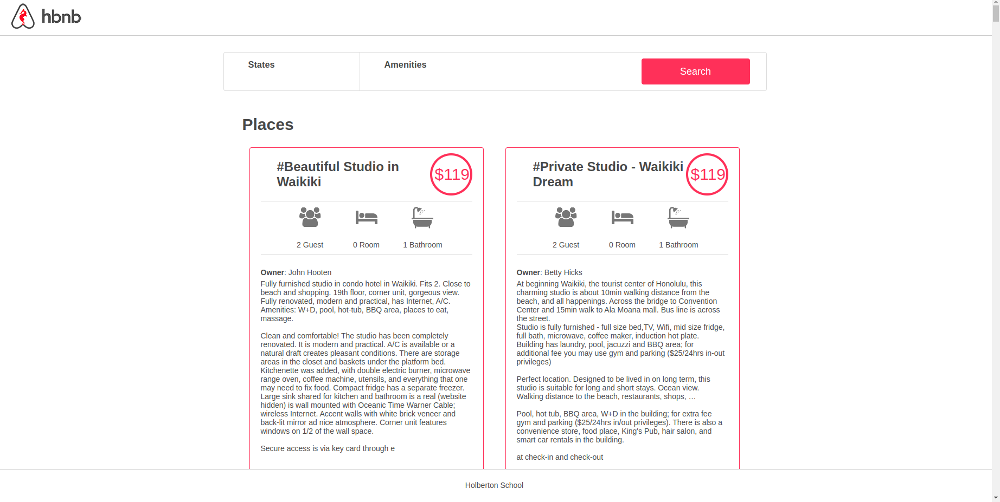

## ArBnB_clone_v2

### A basic clone of the AirBnB Project Build with Flask and MySQL

## Models
- User
- State
- City
- Place
- Amenity

### How to Run
```
pip3 install -r requirements.txt

curl -o 100-dump.sql "https://s3.amazonaws.com/intranet-projects-files/holbertonschool-higher-level_programming+/290/100-hbnb.sql"

cat 100-dump.sql | mysql -uroot -p

HBNB_MYSQL_USER=hbnb_dev HBNB_MYSQL_PWD=hbnb_dev_pwd HBNB_MYSQL_HOST=localhost HBNB_MYSQL_DB=hbnb_dev_db HBNB_TYPE_STORAGE=db python3 -m web_flask.100-hbnb
```
Then visit the following URL on your browser: http://0.0.0.0:5000/hbnb

